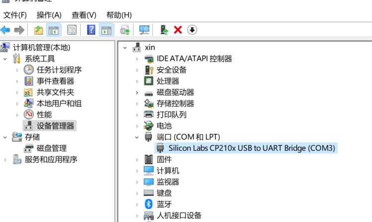
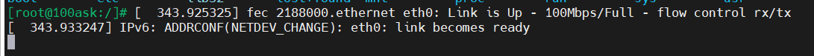
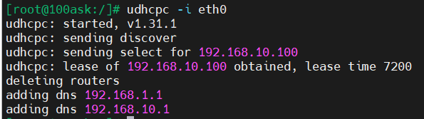
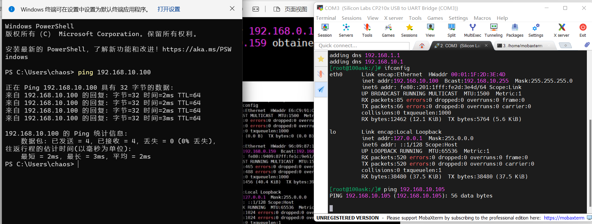

# 快速启动

100ask_imx6ull 第一次上电环境搭建。

## 安装 USB 串口驱动

接上开发板串口线后，右击我的电脑，打开设备管理器。首次使用，电脑可能会缺少 USB 串口驱动，需要进入 [usb-to-uart-bridge-vcp-drivers](https://www.silabs.com/developers/usb-to-uart-bridge-vcp-drivers)，下载并安装该驱动。

```{figure} images/CP210x-windows.png
选择 `CP210x Universal Windows Driver` 下载
```

下载后得到 `CP210x_Universal_Windows_Driver.zip`，解压，然后设备管理器中，右击选择驱动目录，即可安装成功。

安装成功后，即可看到开发板串口被识别出的串口号，此处 COM3：



## 安装 MobaXterm

下载并安装 [MobaXterm](https://mobaxterm.mobatek.net/download-home-edition.html)，该软件可以提供一些便利的开发工具。

可以直接创建串口交互界面：

```{figure} images/MobaXterm.png
1. 打开 MobaXterm
```

```{figure} images/serial-session.png
2. 创建串口会话
```

```{figure} images/serial-ok.png
3. 选择 bps 为 115200
```

```{figure} images/login.png
4. 登录
```

```{figure} images/show.png
5. 可以查看一些信息
```

## 网络测试

接上网线到路由器，可以看到如下网卡信息：



如果你的电脑和开发板都接到路由器，可以请求路由器分配 IP 地址给如上识别到的 eth1 网卡：



这样可以实现与电脑互 ping：


